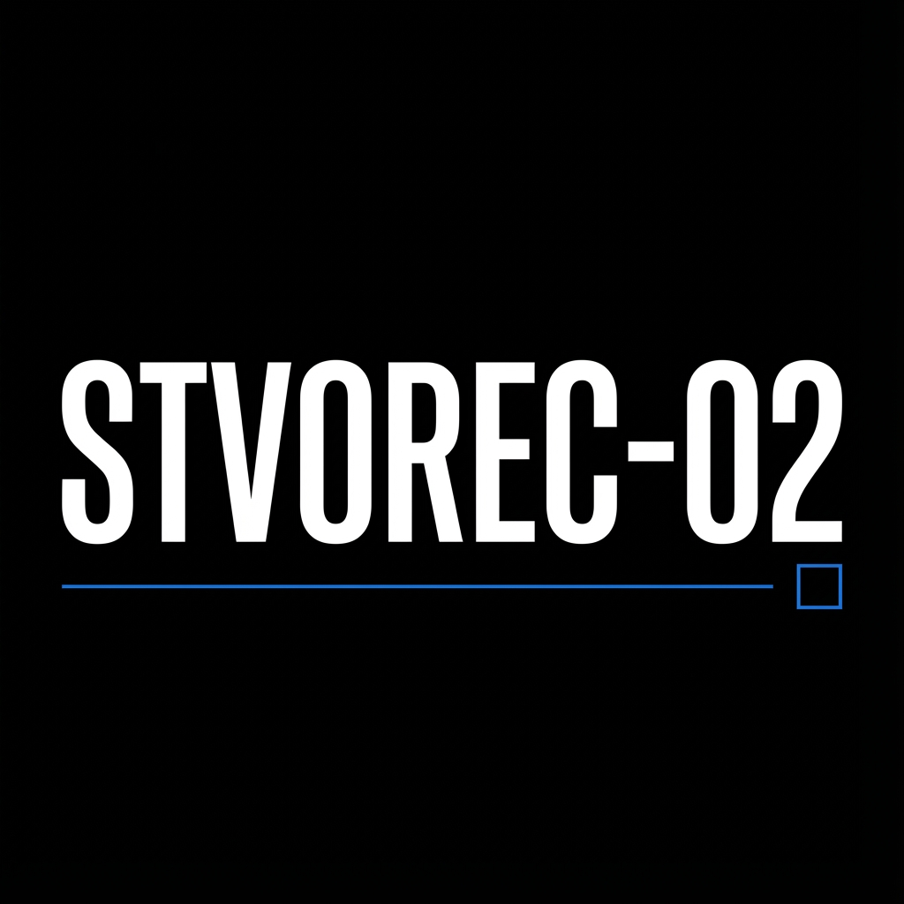

# STVOREC-02



> **Future-proof your career with data-driven insights.**

[](https://opensource.org/licenses/MIT)
[](https://www.python.org/downloads/)
[](https://nextjs.org/)
[](https://fastapi.tiangolo.com/)

## 📖 About The Project

**STVOREC-02** is an advanced analytical tool designed to evaluate the resilience of various professions against the rising tide of Artificial Intelligence. 

In an era of uncertainty, we provide clarity. By leveraging state-of-the-art Large Language Models (LLMs) and complex agentic workflows, STVOREC-02 decomposes job roles into their fundamental atomic units—tasks and skills—to provide a granular automation risk assessment.

It doesn't just predict the future; it helps you navigate it.

### Key Features

*   **🔍 Deep Role Decomposition**: Breaks down any job title into granular tasks and skills for precise analysis.
*   **🤖 AI Automation Scoring**: Calculates a weighted automation potential score based on current AI capabilities (powered by GPT-5.1).
*   **🔮 Future Scenario Generation**: Simulates potential industry shifts by 2030, offering best, worst, and most likely case scenarios.
*   **🧭 Strategic Career Pivots**: Identifies transferable skills and recommends viable career transitions to maximize long-term relevance.

---

## 🛠️ Tech Stack

This project is built with a modern, high-performance stack designed for scalability and real-time analysis.

### Backend
*   **Python 3.11+**: Core logic and data processing.
*   **FastAPI**: High-performance async web framework.
*   **LangChain**: Orchestration of complex AI agent workflows.
*   **OpenAI GPT-5.1**: The underlying intelligence engine.

### Frontend
*   **Next.js 16**: React framework for production-grade applications.
*   **Tailwind CSS 4**: Utility-first CSS framework for rapid UI development.
*   **Framer Motion**: Production-ready motion library for React.
*   **OGL**: Minimal WebGL library for immersive visual effects.

---

## 🚀 Getting Started

Follow these steps to set up the project locally.

### Prerequisites

*   **Python 3.11** or higher
*   **Node.js 18** or higher
*   **Poetry** (Python dependency management)
*   **npm** or **yarn**

### Installation

#### 1. Backend Setup

Navigate to the backend directory and install dependencies:

```bash
cd backend
poetry install
```

Create a `.env` file in the `backend` directory and add your API keys:

```env
OPENAI_API_KEY=your_api_key_here
```

Start the development server:

```bash
poetry run python main.py
```
The backend API will be available at `http://localhost:8000`.

#### 2. Frontend Setup

Navigate to the frontend directory and install dependencies:

```bash
cd frontend
npm install
```

Start the development server:

```bash
npm run dev
```
The application will be available at `http://localhost:3000`.

---

## 💡 Usage

1.  Open the application in your browser.
2.  Enter your current job title and description.
3.  Wait for the AI agents to decompose and analyze your role.
4.  Review your **Automation Score** and explore the **Future Scenarios**.
5.  Check the **Recommendations** tab for suggested upskilling paths.

---

## 📄 License

Distributed under the MIT License. See `LICENSE` for more information.
